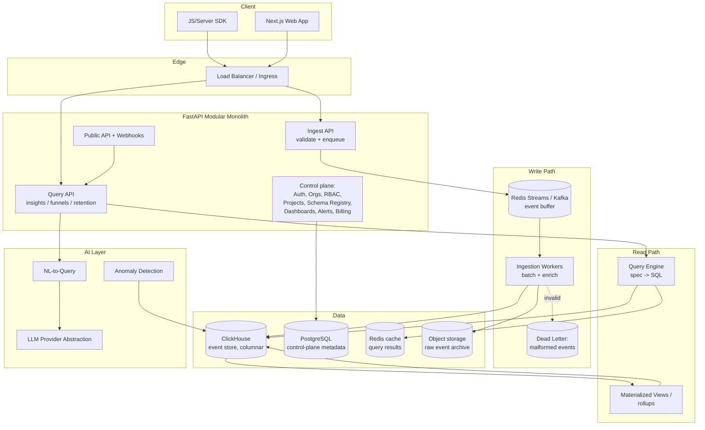
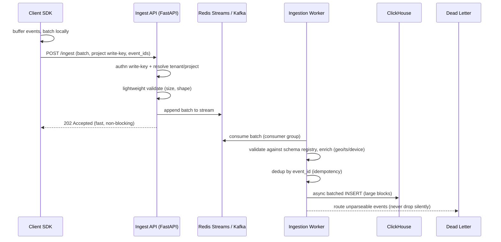
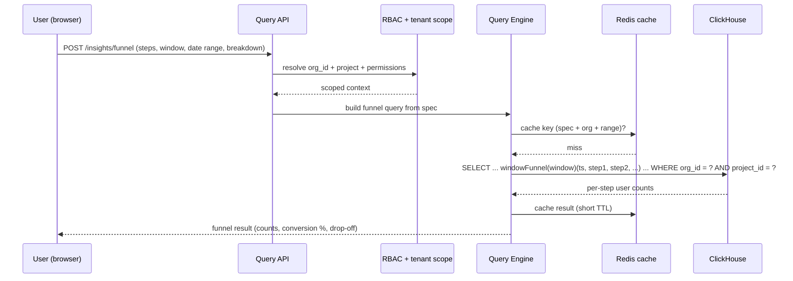

# Pulse — Real-Time Analytics & Event Data Platform

## Build Guide (companion to your Enterprise Project Guide)

> This is the Pulse-specific design-and-roadmap document, written in the same shape as the Helix
> sections of your `ENTERPRISE_PROJECT_GUIDE.md`. It assumes you've already shipped **Helix (#1)**
> and **Flowforge (#6)**, so it deliberately leans on what you now know cold (FastAPI modular
> monolith, Postgres, Redis, workers, Docker, Render deploy, phase-by-phase Claude Code loop) and
> spends its detail on the parts that are *new* to you: high-throughput ingestion, a columnar/OLAP
> store, and correct funnel/retention query math. The companion `SPEC.md` (authoritative engineering
> detail) and `CLAUDE.md` (agent guardrails) should be generated per this design before you write code.

**Assumptions (override any that are wrong):**

- Same builder profile as before — one developer, strong general ability, comfortable in Python +
  TypeScript, using Claude Code as primary assistant.
- Goal is depth and interview signal, specifically to add a **data-intensive systems** story to a
  portfolio that already has an AI platform (Helix) and a backend-correctness engine (Flowforge).
- 6–12 months of runway; PostgreSQL, Docker, and a container cloud (Render to start) as before.
- "Buildable solo with Claude Code" is a hard constraint — every phase leaves a working, demoable app.

**Why Pulse is the right third project:** it exercises a genuinely different muscle from your first two.
Helix and Flowforge are both *orchestration* systems. Pulse is a *data* system — the hard parts are
write throughput, storage layout, and query performance, none of which you've had to fight yet. Finishing
it gives you three distinct, deep interview stories that together span the whole backend spectrum.

---

## PHASE 5 — Product Overview (Pulse)

**Product name:** Pulse

**Vision:** Give any product team full ownership of their analytics — send events from anywhere, then
build funnels, retention curves, and dashboards, and ask questions in plain English — without shipping
their users' behavioral data to a third party or paying per-event SaaS pricing.

**Problem:** Teams need product analytics (the Amplitude / Mixpanel / PostHog category) but the hosted
tools are expensive at volume, opaque about data handling, and inflexible once you outgrow their model.
Rolling your own is hard for a real reason: ingesting events reliably at volume, storing them so queries
stay fast, and computing funnels/retention *correctly* are all non-trivial.

**Target users / personas:**

- **Maya — Growth PM (primary daily user):** builds funnels and retention reports, slices by cohort,
  watches conversion after a launch. Doesn't write SQL.
- **Raj — Data/Analytics Engineer:** defines the event taxonomy, writes raw SQL for deep questions,
  wires the ingestion SDK into the product, trusts the numbers only if the math is right.
- **Dana — Full-stack Developer (integrator):** drops the SDK into web/mobile/server, cares about a
  tiny, reliable client that never drops or double-counts events and never blocks the app.
- **Alex — Eng Lead / buyer:** cares about data ownership, tenant isolation, retention/PII controls,
  and cost at volume.

**Core use cases:**

1. **Track:** send structured events (`user signed up`, `added to cart`, `checkout completed`) with
   properties, from any client, via a small SDK or the raw HTTP ingest API.
2. **Explore:** run ad-hoc queries — event counts, unique users, breakdowns by property, time series.
3. **Funnels:** define an ordered sequence of steps and see conversion + drop-off per step within a
   conversion window, sliceable by cohort.
4. **Retention:** pick a "born" event and a "return" event and see N-day / N-week retention curves and
   cohort grids.
5. **Dashboards:** save insights (charts) and arrange them into shared, refreshing dashboards; set
   threshold/anomaly alerts.
6. **Ask in English:** natural-language questions ("how many users completed checkout on mobile last
   week vs the week before?") translated into a validated, tenant-scoped query.

**Business model possibilities:** usage-based (events ingested / MTUs) + seat tiers; self-hosted
enterprise tier for teams that want data ownership; generous free tier as the wedge (the PostHog play).

**Competitive positioning:** self-hostable, developer-first product analytics that is honest about being
"own your data" — sits against hosted Amplitude/Mixpanel (ownership + cost) and against warehouse-native
tools (batteries-included, no warehouse required to start).

---

## PHASE 6 — Architecture (Pulse)

The defining architectural fact of Pulse: **writes and reads have opposite shapes.** Ingestion is a
firehose of tiny append-only writes that must never block the client and must never silently drop data;
analytics queries are large aggregations over columns across huge row counts. You solve this with a
**write path** (buffer + batch into a columnar store) and a **read path** (a query engine over that
store), kept separate. That separation *is* the project.

### 6.1 System architecture (modular monolith to start)



**Two databases, on purpose.** Postgres holds the *control plane* — users, orgs, projects, roles,
event-schema registry, saved insights, dashboards, alerts, billing. ClickHouse holds the *event plane* —
the append-only behavioral events, at volume. This split is the single most important design decision in
Pulse, and being able to explain *why* (row-store for transactional metadata, column-store for analytical
scans) is exactly the interview signal you're building toward.

### 6.2 Ingestion lifecycle (the write path)



Three things make this the hard, resume-worthy part:

- **The client must never block and never lose.** The SDK buffers, batches, retries with backoff, and
  flushes on interval / size / page-unload. Every event carries a client-generated `event_id` (UUID) so
  a retried batch is deduplicated server-side rather than double-counted.
- **ClickHouse hates small inserts.** It wants large, infrequent blocks. So you *never* insert per-request;
  you buffer (Redis Streams to start, Kafka/Redpanda as the documented upgrade) and let workers insert in
  big batches (or use ClickHouse async inserts / a Buffer table). The Ingest API returns `202` the instant
  the batch is buffered — durability is the buffer's job, not the request's.
- **Bad data is a first-class outcome.** Malformed or schema-violating events go to a dead-letter sink,
  never a silent drop. "How do you handle a poison event at 10k events/sec?" is a question you'll be able
  to answer with real code.

### 6.3 Query lifecycle: a funnel (the read path)



**Funnel and retention math is where correctness lives — build on ClickHouse's native functions rather
than hand-rolling:**

- **Funnels:** ClickHouse's `windowFunnel(window)(timestamp, cond1, cond2, ...)` returns, per user, the
  length of the longest *ordered* prefix of steps completed within the time window. You then bucket users
  by how far they got to produce per-step counts and conversion/drop-off. Getting the window semantics and
  "must happen in order" right is the classic funnel bug; leaning on `windowFunnel` is the correct move and
  the thing to understand deeply.
- **Retention:** ClickHouse's `retention(cond0, cond1, ...)` returns, per user, an array marking which of
  the later conditions held given the first held — you aggregate that into cohort N-day/N-week grids.
- **Uniques:** `uniqExact` for correctness on small sets, `uniq`/`uniqCombined` (HyperLogLog) when you
  need speed at volume — knowing when to trade exactness for speed is itself a talking point.

### 6.4 Storage & OLAP design (ClickHouse)

- **Engine:** `MergeTree` family for the raw events table. Pre-aggregations use `AggregatingMergeTree` /
  `SummingMergeTree` via materialized views.
- **The events table shape:** a wide, mostly-append-only table. Core columns (`org_id`, `project_id`,
  `event_name`, `user_id`, `anonymous_id`, `timestamp`, `received_at`, `event_id`) as typed columns; the
  open-ended `properties` as a `Map(String, String)` (or JSON column) so you get schema flexibility without
  a migration per new property. Registry-known properties can be *promoted* to typed materialized columns
  later for speed.
- **Partitioning:** `PARTITION BY (org_id, toYYYYMM(timestamp))` — keeps each tenant's months separable,
  makes retention/TTL drops cheap, and bounds the data any one query touches.
- **Ordering (the primary index):** `ORDER BY (org_id, project_id, event_name, timestamp)` so the
  overwhelmingly common filter (this tenant, this project, this event, this time range) is a fast range
  scan. Order key choice is *the* performance lever in ClickHouse — worth an explicit design note in SPEC.
- **Rollups:** nightly/continuous materialized views for common aggregates (daily active users, per-event
  daily counts) so dashboards read pre-aggregated rows instead of scanning raw events.
- **Retention/TTL:** ClickHouse `TTL` on the timestamp column to auto-expire raw events past a tenant's
  retention window (and/or roll them into aggregates first).
- **Start-simple option:** if standing up ClickHouse early is friction, you *can* prototype the query
  engine against **DuckDB** (embedded, zero-ops) and swap the storage adapter to ClickHouse later — but
  design the ingestion/query interfaces so ClickHouse is the real target. Don't ship on DuckDB; the whole
  point is the columnar-at-volume story.

### 6.5 Multi-tenancy

Shared-cluster, shared-table, with `org_id` (and `project_id`) as **mandatory leading columns** in both
the partition key and the sort key of the events table, and injected into *every* query by the query
engine — never trusted from the client. In Postgres, the control plane uses the same `org_id`-on-every-row
+ Row-Level Security pattern you already built in Helix (reuse it). The ClickHouse discipline is the new
part: there's no RLS safety net there, so tenant isolation is enforced entirely in the query-building layer
— which means that layer needs **tenant-leakage tests** as seriously as Helix's ACL tests.

### 6.6 Authentication & authorization

- **AuthN (control plane):** JWT access + refresh, Argon2 passwords, sessions/revocation, OAuth/OIDC for
  SSO — essentially the Helix auth module, reusable almost verbatim.
- **Ingestion auth (new):** per-project **write keys** (public, client-side, write-only, can only append
  events to their project) kept distinct from **read/API keys** (server-side, scoped, can query). This
  public-write-key / private-read-key split is standard for analytics SDKs and a deliberate design point.
- **AuthZ:** RBAC (Owner/Admin/Member/Viewer) on projects and dashboards; every query resolves tenant +
  project scope before the query engine runs.

### 6.7 Data, caching, queues, storage

- **PostgreSQL** — all control-plane relational data (reuse the Helix foundation).
- **ClickHouse** — the event store (the new center of gravity).
- **Redis** — event buffer (Streams) to start, query-result cache, and rate limiting.
- **Kafka / Redpanda** — the documented upgrade path for the buffer when Redis Streams stops keeping up;
  design the worker consumer so this is a swap, not a rewrite.
- **Object storage (S3/MinIO)** — raw event archive (replay/backfill source of truth) and large exports.

### 6.8 Observability & deployment

- **Observability:** structured JSON logs with correlation IDs; OpenTelemetry traces that follow a request
  from Ingest API → buffer → worker → ClickHouse; Prometheus/Grafana. The Pulse-specific dashboards that
  matter: **ingestion lag** (buffer depth / consumer lag), **insert batch sizes**, **events/sec**,
  **dead-letter rate**, and **query latency percentiles**. These metrics *are* the product's health.
- **Deployment:** Docker + Compose locally (api, ingest-worker, postgres, clickhouse, redis, minio,
  frontend). One image, multiple entrypoints (api vs worker), as in Helix. CI via GitHub Actions; deploy to
  Render to start (managed Postgres + Redis; ClickHouse via ClickHouse Cloud or a self-managed container),
  with a documented path to ECS/GKE later.

### 6.9 How it evolves to microservices

Start as a **modular monolith** with clean module boundaries. When a bottleneck appears, extract in this
order: (1) the **Ingest API** → its own horizontally-scaled service (it has the opposite scaling profile
from everything else — pure write throughput); (2) the **ingestion workers** → their own fleet sized to
buffer depth; (3) the **query service** → separate so heavy analytical queries can't starve ingestion.
Because ingestion already talks to the rest only through the buffer, extracting it is a deployment change,
not a rewrite. As with Helix: resist doing this early.

---

## PHASE 7 — The hard parts, named (so you can plan for them)

These are the five problems that make Pulse a real systems project. Each maps to phases below.

1. **Ingestion reliability at volume** — non-blocking client, at-least-once buffering, `event_id`
   idempotency/dedup, dead-letter for poison events, backpressure when the buffer fills.
2. **Columnar storage layout** — partition/order key design, `Map`/JSON properties vs promoted columns,
   materialized-view rollups, TTL-based retention.
3. **Correct analytics math** — funnels (ordered, windowed), retention (cohort grids), unique counts
   (exact vs approximate), timezone-correct bucketing.
4. **Query performance & cost** — result caching, pre-aggregation, bounding scans via the sort key,
   protecting the cluster from a pathological ad-hoc query.
5. **Safe NL-to-query** — translating English to a validated, read-only, tenant-scoped query without
   letting the LLM emit arbitrary SQL against your cluster.

---

## PHASE 8 — Claude Code Implementation Phases

Same rules as your Helix build: each phase leaves the app **working and demoable**; don't start a phase
until the previous one's Definition of Done is met; `SPEC.md` carries authoritative detail; ship a git tag
at each phase boundary; one phase ≈ 1–4 weeks of evenings/weekends.

> **Reuse note:** Phases 0–5 are substantially the same SaaS foundation you built for Helix (repo scaffold,
> backend foundation, tenant models + RLS, auth, orgs/membership, RBAC). Have Claude Code port that
> structure rather than reinvent it — then spend your real energy from Phase 6 onward, which is all new.

**Phase 0 — Repository & architecture setup**
- *Objective:* Monorepo scaffold, tooling, CI skeleton, `SPEC.md`/`CLAUDE.md` in place.
- *Features:* repo structure; `docker-compose` with Postgres + **ClickHouse** + Redis + MinIO; lint/format/
  type-check; pre-commit; empty CI; `/health` endpoint that also checks ClickHouse connectivity.
- *DoD:* `docker compose up` boots everything (including ClickHouse); CI green; health check passes.

**Phase 1 — Backend foundation**
- *Objective:* App skeleton: config, DB sessions (Postgres **and** a ClickHouse client), error handling,
  structured logging, OpenAPI, migrations (Alembic for Postgres; a versioned DDL/migration approach for
  ClickHouse).
- *DoD:* clean layered structure; both stores reachable; migrations run in CI; logs structured.

**Phase 2 — Database & core models (control plane)**
- *Objective:* Tenant models + RLS in Postgres. *(Port from Helix.)*
- *Features:* `User`, `Organization`, `Membership`, `Project`, base mixins, soft-delete, RLS.
- *DoD:* tenant isolation proven by tests; migrations reversible.

**Phase 3 — Authentication** *(port from Helix)*
- *Features:* Argon2, JWT access+refresh, sessions/revocation, `/auth/*`, auth rate limiting.
- *DoD:* signup → login → protected route; tokens rotate.

**Phase 4 — Organizations, projects & membership**
- *Objective:* Multi-tenant org + **project** lifecycle (projects are the analytics unit and the write-key
  boundary).
- *Features:* org CRUD, project CRUD, invites, org/project switcher, member management.
- *DoD:* a user creates an org and a project, invites another, each sees only their org's data.

**Phase 5 — RBAC & API keys**
- *Objective:* Roles enforced everywhere + the two-key model.
- *Features:* Owner/Admin/Member/Viewer; **project write-keys** (append-only) and **read/API keys**
  (scoped); permission checks as dependencies; authz auditing.
- *DoD:* no endpoint reachable without a permission check; write-keys can only ingest, read-keys can only
  query.

**Phase 6 — Event model & ClickHouse schema** *(new territory starts here)*
- *Objective:* The events table and its layout, done right.
- *Features:* events table (`MergeTree`) with core typed columns + `properties Map`, partition key
  `(org_id, toYYYYMM(timestamp))`, sort key `(org_id, project_id, event_name, timestamp)`; a documented
  migration approach; seed/fixture generator for fake events.
- *Tests:* insert + read round-trip; partition/sort behavior; tenant column always present.
- *DoD:* you can hand-insert events and query them back, scoped by tenant/project.

**Phase 7 — Ingest API**
- *Objective:* Accept event batches fast and safely.
- *Features:* `POST /ingest` (batch), write-key auth, lightweight validation, `event_id` capture, enqueue
  to Redis Streams, `202` response; request-size limits + rate limiting; CORS for browser SDKs.
- *Tests:* batch accepted and buffered; oversized/malformed rejected cleanly; write-key scoping.
- *DoD:* posting a batch returns `202` and lands events in the buffer; nothing writes to ClickHouse
  synchronously.

**Phase 8 — Ingestion workers (buffer → ClickHouse)**
- *Objective:* Durable, batched, idempotent consumption.
- *Features:* consumer-group workers; batch accumulation (size/time trigger); schema-registry validation;
  enrichment (server timestamp, geo/device from headers); **dedup by `event_id`**; large batched inserts;
  **dead-letter** for poison events; archive raw batches to object storage.
- *Tests:* idempotent re-consume (no double count); poison event → DLQ not drop; worker crash mid-batch →
  no loss (at-least-once) and no dup (dedup); backpressure when buffer is deep.
- *DoD:* events posted to `/ingest` become queryable in ClickHouse asynchronously; failures are visible in
  the DLQ; replaying a batch doesn't double-count.

**Phase 9 — Event schema registry**
- *Objective:* Governed, discoverable event taxonomy without losing flexibility.
- *Features:* auto-register newly-seen event names + property keys/types (schema-on-read with a catalog);
  ability to mark events/properties as official, deprecate, or hide; drives autocomplete in the query UI.
- *Tests:* new event auto-registers; type conflicts flagged; registry scoped per project.
- *DoD:* the UI can list a project's events and properties; unknown events still ingest (never blocked).

**Phase 10 — Ingestion SDK**
- *Objective:* A tiny client that never blocks and never loses.
- *Features:* a JS/TS SDK (browser + Node) — `identify`, `track`, `page`; local buffering; batch flush on
  interval/size/`beforeunload`; retry with backoff; `event_id` generation; a thin server SDK too.
- *Tests:* offline buffering; flush triggers; retry/idempotency; no event loss on page unload.
- *DoD:* dropping the SDK into a demo page reliably delivers events end-to-end.

**Phase 11 — Query engine & ad-hoc insights**
- *Objective:* The read path: a safe spec → SQL builder.
- *Features:* an insight spec (event(s), measure = count / unique users, filters on properties, breakdown
  dimension, date range, granularity); a **query builder** that compiles the spec to ClickHouse SQL with
  `org_id`/`project_id` **always injected**; result caching (Redis, short TTL); query timeouts + row/scan
  caps.
- *Tests:* spec→SQL correctness; **tenant-leakage tests** (no query escapes its org); timezone-correct
  bucketing; cache hit/miss.
- *DoD:* a user builds an event trend (e.g., daily unique users of `checkout completed`), filtered and
  broken down, and gets a correct, fast, tenant-scoped result.

**Phase 12 — Funnels**
- *Objective:* Ordered, windowed conversion analysis.
- *Features:* funnel spec (ordered steps, conversion window, date range, optional breakdown); build on
  `windowFunnel`; per-step counts, conversion %, drop-off; cohort breakdown.
- *Tests:* ordering enforced; window boundaries; a hand-computed fixture funnel matches the engine exactly.
- *DoD:* a 3-step funnel over seeded data returns numbers you can verify by hand.

**Phase 13 — Retention**
- *Objective:* Cohort retention grids.
- *Features:* retention spec (born event, return event, N-day/N-week, date range); build on `retention`;
  cohort grid + curve output.
- *Tests:* cohort assignment; day/week bucketing; a hand-computed retention fixture matches.
- *DoD:* a weekly retention grid over seeded data matches a hand calculation.

**Phase 14 — Frontend foundation & core UI** *(shell portable from Helix)*
- *Features:* app shell, nav, design system (Tailwind + components), TanStack Query, forms, loading/error
  states, auth-aware routing, org/project switcher.
- *DoD:* consistent responsive shell wrapping existing features.

**Phase 15 — Insight builder & chart UI**
- *Objective:* Visual exploration.
- *Features:* insight builder (pick event/measure/filter/breakdown/range) with schema-driven autocomplete;
  chart rendering (line/bar/table); funnel + retention visualizations; save insights.
- *Tests:* builder produces valid specs; charts render each result type; saved insights reload.
- *DoD:* a non-SQL user builds, views, and saves a trend, a funnel, and a retention report from the UI.

**Phase 16 — Dashboards**
- *Objective:* Arrange and share saved insights.
- *Features:* dashboard CRUD, add/arrange saved insights (grid layout), per-dashboard date range, refresh,
  sharing within the org (RBAC), read from rollups where available.
- *Tests:* layout persistence; permission-scoped sharing; refresh correctness.
- *DoD:* a user assembles a dashboard of several insights and shares it read-only with a teammate.

**Phase 17 — Materialized rollups & performance**
- *Objective:* Keep dashboards fast as data grows.
- *Features:* materialized views for common aggregates (DAU/WAU/MAU, per-event daily counts); route
  eligible queries to rollups; query-plan review; sort-key/index tuning; per-tenant query rate limits;
  load tests (k6/Locust) on ingest + query.
- *Tests:* rollup correctness vs raw; documented before/after benchmarks.
- *DoD:* dashboard queries hit pre-aggregates and meet a stated latency target under load.

**Phase 18 — NL-to-query (AI)**
- *Objective:* English → validated insight, safely.
- *Features:* LLM provider abstraction (reuse Helix's); translate NL to the **insight spec** (not raw SQL),
  then compile through the existing safe builder so tenant scoping and caps are inherited; show the user the
  interpreted spec before running; guardrails (read-only, allow-listed operations, cost/row caps).
- *Tests:* prompt-injection attempts can't produce cross-tenant or write queries; ambiguous questions ask
  for clarification; a fixed eval set of NL→spec pairs gates regressions.
- *DoD:* a user asks a plain-English question and gets a correct, tenant-scoped answer with the
  interpretation shown; no path emits arbitrary SQL.

**Phase 19 — Anomaly detection & alerts (AI)**
- *Objective:* Tell users when a metric moves.
- *Features:* per-insight thresholds and time-series anomaly detection (start with robust statistical
  methods — moving average + z-score / seasonal baseline — before anything fancier); alert rules; delivery
  (email + in-app; webhook out).
- *Tests:* alert fires on breach, not on noise; seasonality handled; delivery honored.
- *DoD:* an alert on a tracked metric fires when the metric anomalously drops/spikes.

**Phase 20 — Billing & usage metering**
- *Objective:* Meter what actually costs money — ingested events / MTUs.
- *Features:* Stripe (test mode), plans, event/MTU metering from real ingestion counts, quotas + soft/hard
  limits, invoices.
- *Tests:* metering accuracy against ingested volume; quota enforcement; webhook handling.
- *DoD:* usage is metered from real ingestion and enforced; plan changes work in Stripe test mode.

**Phase 21 — Public API, exports & webhooks**
- *Objective:* Programmatic access + data portability.
- *Features:* scoped read API for insights/funnels/retention; CSV/JSON export of query results and raw
  events (data-ownership story); outbound webhooks (signed, retried) on alerts.
- *Tests:* key scoping; export correctness/completeness; webhook signing/retry.
- *DoD:* an external client can query insights and export raw events via the API; alert webhooks deliver
  reliably.

**Phase 22 — Security hardening, retention & PII**
- *Objective:* Close the gaps specific to behavioral data.
- *Features:* per-project **data-retention windows** via ClickHouse TTL; **PII controls** (property
  allow/deny lists, hashing/dropping configured fields at ingest); GDPR-style **user-deletion** (delete a
  subject's events across partitions); input validation sweep; security headers; dependency scanning;
  NL-to-query injection tests; threat model.
- *Tests:* TTL actually expires old data; deletion request removes a user's events; PII fields never land
  in ClickHouse; injection suite passes.
- *DoD:* a written threat model exists; retention, PII, and deletion each have a control + test.

**Phase 23 — Observability, CI/CD & cloud deployment**
- *Objective:* Ship it and see it.
- *Features:* OTel traces UI→API→buffer→worker→ClickHouse; Grafana dashboards for ingestion lag, batch
  size, events/sec, DLQ rate, query p50/p95/p99; Sentry; full CI (lint/type/test/build/scan);
  migrations-on-deploy (Postgres + ClickHouse DDL); staging + prod on Render; IaC for managed services.
- *DoD:* a merge to main deploys to staging automatically; prod deploy is one gated click; a single trace
  follows an event from SDK to ClickHouse; the health dashboards are live.

*(Beyond 23: session/event replay, warehouse-native mode — query the user's own Snowflake/BigQuery —
reverse ETL, sampling for huge tenants, a Kafka-based ingestion tier, and multi-region.)*

---

## PHASE 10 — Kickoff Assets

### K. The exact first Claude Code prompt to use

After you've created the repo and dropped in `SPEC.md` and `CLAUDE.md`, open the repo in VS Code, start
Claude Code, and paste this as your **first** message:

```
Read CLAUDE.md and SPEC.md in full before doing anything else. Do not write any
application code yet.

We are building "Pulse", the real-time analytics / event data platform described in
SPEC.md. We work strictly phase-by-phase per the roadmap in SPEC.md; today we are doing
ONLY Phase 0 (Repository & architecture setup). Do not implement any later phase.

Key architectural facts you must respect from the start (details in SPEC.md):
- Two data stores: PostgreSQL for the control plane, ClickHouse for the event store.
  They are separate on purpose.
- The write path (ingest -> buffer -> workers -> ClickHouse) and the read path
  (query engine -> ClickHouse) are separate. Ingestion is never a synchronous write
  to ClickHouse.

For Phase 0, produce a plan first (no code), covering:
1. The monorepo directory structure (backend FastAPI modular monolith, frontend
   Next.js, ingestion SDK package, infra/docker, docs) with a short rationale per
   top-level dir.
2. The exact toolchain: Python deps + versions (FastAPI, Pydantic v2, SQLAlchemy 2,
   Alembic, a ClickHouse client, pytest, ruff, mypy), Node/Next.js/TypeScript/Tailwind,
   pre-commit.
3. A docker-compose.yml service list (api, ingest-worker, postgres, clickhouse, redis,
   minio, frontend) -- describe it, don't write it yet.
4. The CI skeleton (GitHub Actions jobs: lint, type-check, test, build).
5. The single Phase 0 acceptance test: `docker compose up` boots everything including
   ClickHouse, and a `/health` endpoint returns 200 (checking both Postgres and
   ClickHouse connectivity), reachable from the Next.js app, with CI green.

Show me this plan and wait for my approval. After I approve, implement Phase 0 only,
create the files, run everything locally to prove the health check passes, and stop.
Meet the Definition of Done for Phase 0 in SPEC.md before declaring the phase complete.
Write tests as specified and do not proceed to Phase 1.
```

Every subsequent phase kickoff follows the same template — swap "Phase 0" for the next phase and reference
its section in `SPEC.md`. The point is unchanged from Helix: force Claude Code to *read the spec*, *plan
before coding*, and *stay inside one phase*.

### L. VS Code project initialization steps

1. **Create the repo & open it**
   ```bash
   mkdir pulse && cd pulse
   git init
   ```
   Open the folder in VS Code (`code .`).

2. **Generate and drop in the design docs** at the repo root: `SPEC.md` (authoritative engineering detail
   for Pulse, expanded from this guide) and `CLAUDE.md` (agent guardrails), plus this
   `PULSE_PROJECT_GUIDE.md` (keep it in `/docs` if you prefer). Commit them *before* any code:
   ```bash
   git add SPEC.md CLAUDE.md && git commit -m "docs: add Pulse architecture spec and Claude Code guardrails"
   ```

3. **Install VS Code tooling:** Python, Pylance, Ruff, Docker, ESLint/Tailwind extensions, and the Claude
   Code integration. Sign in.

4. **Secrets hygiene from day one:** `.gitignore` for `.env`, `.env.*`, `__pycache__`, `node_modules`,
   `.venv`; commit `.env.example`, never real secrets. Note you'll have *two* sets of credentials
   (Postgres + ClickHouse) and per-project write/read keys — keep them straight in `.env.example`.

5. **Branch strategy:** `feature/phase-N-*` → PR into `main` → tag `phase-N-complete` at each DoD.

6. **Start Claude Code and paste the Phase 0 prompt above.** Approve the plan, let it scaffold, verify
   `docker compose up` + health check locally (confirm ClickHouse is actually reachable), commit, tag
   `phase-0-complete`.

7. **Repeat the loop for months:** for each phase — (a) tell Claude Code to read `SPEC.md` + the phase,
   (b) plan first, (c) approve, (d) implement with tests, (e) run tests + the phase acceptance check,
   (f) commit in focused chunks, (g) tag, (h) update `SPEC.md`/`CLAUDE.md` if behavior changed.

---

### One efficiency tip specific to your situation

Because Phases 0–5 are ~80% the SaaS foundation you already built in Helix (repo scaffold, backend
foundation, tenant models + RLS, auth, orgs/membership, RBAC, provider abstraction, the Next.js shell),
tell Claude Code to **port and adapt** those from your Helix repo rather than regenerate from scratch. That
can compress the first several weeks into a fraction of the time and let you reach the genuinely new work —
the ClickHouse event store, the ingestion pipeline, and the funnel/retention query engine — much sooner.
That new work is also exactly what the interview story rides on, so it's where your months are best spent.

---

*Companion files to generate next: `SPEC.md` (full engineering specification for Pulse) and `CLAUDE.md`
(Claude Code operating rules for this repo).*
